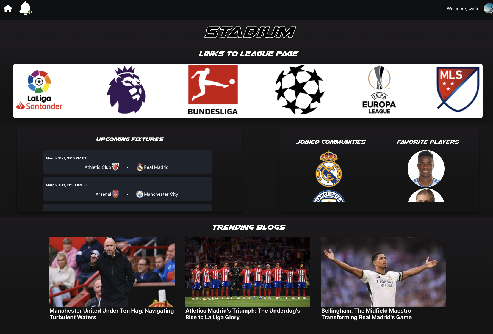

# Stadium - Your All-in-One Soccer Fan Platform

Welcome to Stadium, the ultimate app for soccer fans to connect, share, and engage with their favorite teams and leagues.

## Overview

Stadium is a feature-rich platform where soccer enthusiasts can personalize their experience, join team communities, read and create blogs, and much more. 

## Features

- **Customizable Dashboard:** Personalize your dashboard by adding the soccer leagues you are interested in. Get quick access to league pages and trending blogs.

- **League Pages:** Explore dedicated pages for each soccer league, featuring blogs, comments, and a vibrant community of fans.

- **Trending Blogs:** Discover the hottest blogs curated from users across the platform. Like, dislike, and engage with trending content.

- **Team Communities:** Join communities for your favorite teams. Connect with fellow fans, share updates, and engage in discussions.

- **User Interaction:** Like and dislike posts, comment on blogs, and reply to other users. Foster a dynamic and interactive community.

## Tech Stack

- **Frontend:** React.js
- **Backend:** Node.js, Express
- **Database:** MongoDB
- **Authentication:** JWT

## Back End Repository

[Back End Repository](https://github.com/walter0916/Stadium-back-end.git)
